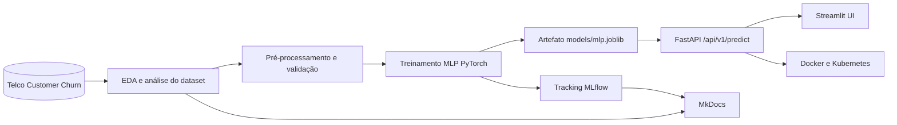
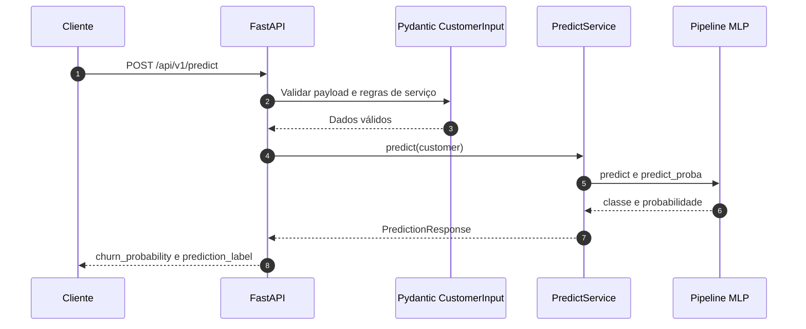

# Tech Challenge Fase 1 - Predição de Churn Telco

Pipeline de Machine Learning para prever churn de clientes Telco usando PyTorch, MLflow, FastAPI e Streamlit.


## Sumário

- [Visão geral](#visão-geral)
- [Links da entrega](#links-da-entrega)
- [Arquitetura](#arquitetura)
- [Resultados do modelo](#resultados-do-modelo)
- [Como executar](#como-executar)
- [Dados](#dados)
- [API de inferência](#api-de-inferência)
- [Docker](#docker)
- [Kubernetes](#kubernetes)
- [Documentação](#documentação)
- [Estrutura do projeto](#estrutura-do-projeto)
- [Licença](#licença)

## Visão geral

Este projeto resolve um problema de classificação binária: identificar clientes com maior probabilidade de churn a partir do dataset Telco Customer Churn. A solução inclui:

- treinamento de uma rede neural MLP em PyTorch;
- rastreamento de experimentos com MLflow;
- persistência local do artefato `models/mlp.joblib`;
- API FastAPI para predição online;
- interface Streamlit para consumir a API;
- documentação versionada com MkDocs;
- empacotamento Docker e manifests Kubernetes.

> [!IMPORTANT]
> O modelo final usado pela API é gerado localmente por `make train`. O arquivo `models/mlp.joblib` não deve ser versionado.

## Links da entrega

- [Vídeo de apresentação](https://youtu.be/SZ2oaqu27qI?si=BVy0UwchjEoij8Bh)
- [Documentação publicada](https://dionisilva.github.io/tech-challenge-fase-1)
- [Swagger da API](http://100.26.100.251:8000/docs)

## Arquitetura



Fluxo de uma chamada de predição:



Mais detalhes estão em [Arquitetura](docs/docs/arquitetura.md).

## Resultados do modelo

Resumo do modelo final documentado no [Model Card](docs/docs/MODEL_CARD.md):

| Métrica | Valor |
|---|---:|
| Acurácia (treino) | 0.6998 |
| Precisão | 0.4594 |
| Sensibilidade | 0.8986 |
| F1-Score | 0.6080 |
| ROC-AUC | 0.8597 |

A métrica de maior interesse operacional é a sensibilidade, pois o objetivo é localizar clientes com risco real de cancelamento para ações de retenção. O comparativo completo entre modelos está em [Comparativo entre Modelos](docs/docs/comparativo-modelos.md).

## Como executar

### Requisitos

- Python 3.12
- `uv`
- `make`

### Ambiente completo de desenvolvimento

```bash
make setup
```

Esse target instala dependências de runtime, treino, notebooks, documentação, UI e testes.

## Dados

O dataset oficial é versionado no repositório neste caminho:

```text
data/raw/Telco_customer_churn.xlsx
```

> [!NOTE]
> `make serve` treina o modelo automaticamente quando `models/mlp.joblib` não existe. Por isso, em um clone novo, `make serve` depende do dataset versionado em `data/raw/`.

### Treinar o modelo

```bash
make train
```

O treinamento gera `models/mlp.joblib`, artefato usado pela API e pela imagem Docker.

### Subir a API

```bash
make serve
```

A API fica disponível em `http://localhost:8000`.

### Subir API e UI Streamlit

```bash
make serve WITH_UI=true
```

A UI fica disponível em `http://localhost:8501` e consulta a API em `http://localhost:8000` por padrão.

### Qualidade e testes

```bash
make lint
make format
make test
```

### Documentação local

```bash
make docs
```

O site MkDocs fica disponível no endereço exibido pelo comando.

### MLflow

```bash
make run-mlflow
```

A UI do MLflow sobe em `http://127.0.0.1:5000`.

## API de inferência

Endpoints principais:

| Método | Endpoint | Descrição |
|---|---|---|
| `GET` | `/` | Metadados da API |
| `GET` | `/api/v1/health` | Health check com disponibilidade do modelo |
| `POST` | `/api/v1/predict` | Predição de churn |

Exemplo mínimo de chamada:

```bash
curl -X POST http://localhost:8000/api/v1/predict \
  -H "Content-Type: application/json" \
  -d '{
    "customer_id": "5575-GNVDE",
    "zip_code": 90001,
    "gender": "Male",
    "senior_citizen": "Yes",
    "partner": "Yes",
    "dependents": "Yes",
    "tenure_months": 48,
    "phone_service": "Yes",
    "multiple_lines": "Yes",
    "internet_service": "Fiber optic",
    "online_security": "No",
    "online_backup": "No",
    "device_protection": "No",
    "tech_support": "No",
    "streaming_tv": "Yes",
    "streaming_movies": "Yes",
    "contract": "One year",
    "paperless_billing": "No",
    "payment_method": "Credit card (automatic)",
    "monthly_charges": 105.25,
    "total_charges": 5046.0
  }'
```

A documentação interativa da API fica disponível localmente em `http://localhost:8000/docs` e no Swagger público em [http://100.26.100.251:8000/docs](http://100.26.100.251:8000/docs).

## Docker

O build da imagem exige o modelo treinado localmente.

```bash
make setup
make train
make docker-build
```

Execução local:

```bash
docker run --rm -p 8000:8000 tech-challenge-fase-1:local
```

## Kubernetes

Os manifests ficam em `k8s/`.

Renderizar manifests:

```bash
kubectl kustomize k8s/overlays/local
```

Aplicar no cluster:

```bash
kubectl apply -k k8s/overlays/local
```

## Documentação

A documentação completa fica em `docs/docs/` e é publicada localmente com MkDocs.

Links principais:

- [Primeiros passos](docs/docs/getting-started.md)
- [Arquitetura](docs/docs/arquitetura.md)
- [ML Canvas](docs/docs/ml-canvas.md)
- [Dataset](docs/docs/dataset.md)
- [Model Card](docs/docs/MODEL_CARD.md)
- [Comparativo entre Modelos](docs/docs/comparativo-modelos.md)
- [MLflow](docs/docs/mlflow.md)
- [Comandos](docs/docs/comandos.md)

## Estrutura do projeto

```text
.
├── README.md
├── Makefile
├── pyproject.toml
├── Dockerfile
├── data/
├── docs/
│   ├── mkdocs.yml
│   └── docs/
├── k8s/
├── models/
├── notebooks/
├── reports/
│   └── figures/
├── src/
│   ├── api/
│   ├── core/
│   ├── data/
│   ├── modeling/
│   ├── schemas/
│   ├── services/
│   ├── ui/
│   └── utils/
└── tests/
```

## Licença

Este projeto está licenciado sob os termos da licença [MIT](LICENSE).
