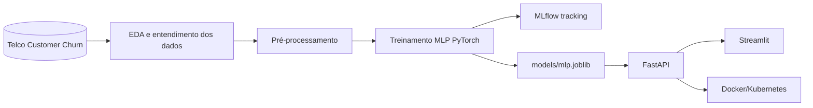
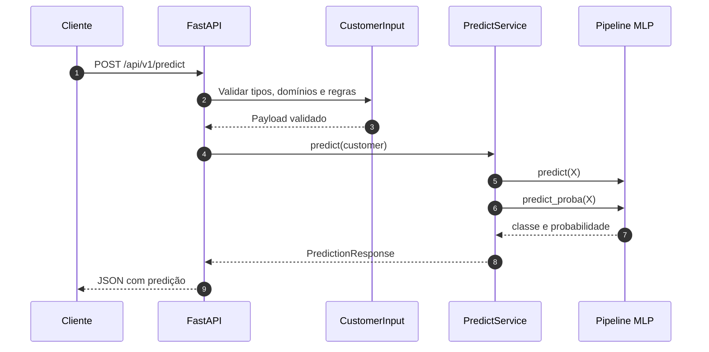

# Arquitetura

Esta página descreve o fluxo técnico do projeto, do dataset até a exposição do modelo por API.

## Pipeline de ML



## Responsabilidades dos componentes

| Componente | Responsabilidade |
|---|---|
| `notebooks/` | Exploração, comparação de modelos e documentação analítica |
| `src/train_mlp.py` | Execução do treinamento completo do modelo MLP |
| `src/modeling/` | Componentes de modelagem, treino e avaliação |
| `src/data/` | Configurações e transformadores usados pelo pipeline |
| `src/services/predict_service.py` | Carregamento do artefato e execução da inferência |
| `src/schemas/customer.py` | Contrato público de entrada e saída da API |
| `src/api_main.py` | Aplicação FastAPI e configuração dos roteadores |
| `src/ui/` | Interface Streamlit que consome a API |
| `docs/docs/` | Documentação versionada do projeto |
| `k8s/` | Manifests Kubernetes para deploy local |

## Fluxo da API



## Artefato do modelo

O artefato operacional da aplicação é `models/mlp.joblib`. Ele é gerado por:

```bash
make train
```

O `make serve` também executa o treinamento automaticamente quando o artefato ainda não existe. Para Docker, o fluxo recomendado é explícito:

```bash
make setup
make train
make docker-build
```

## Observabilidade e rastreabilidade

O projeto usa MLflow em modo local para registrar experimentos, métricas e artefatos em `data/mlflow_tracking/mlruns/`.

```bash
make run-mlflow
```

A API usa logging estruturado para registrar requisições, health checks e predições.
