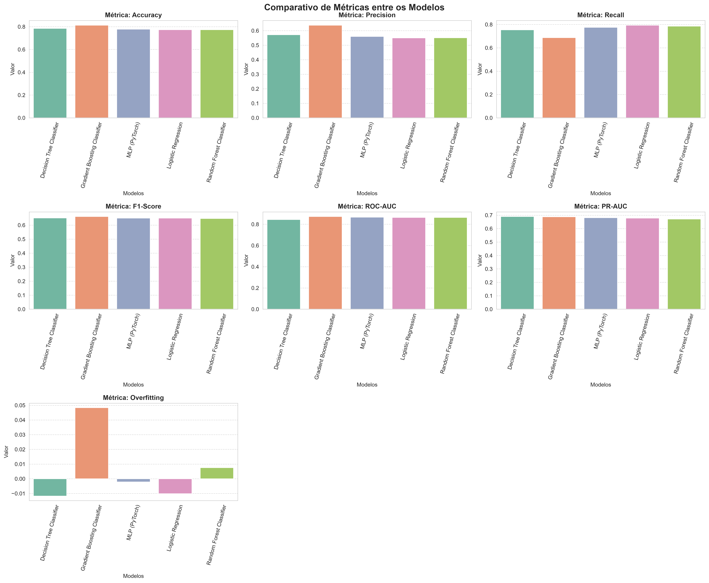
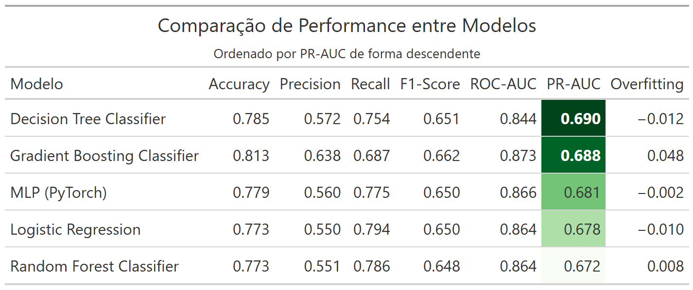
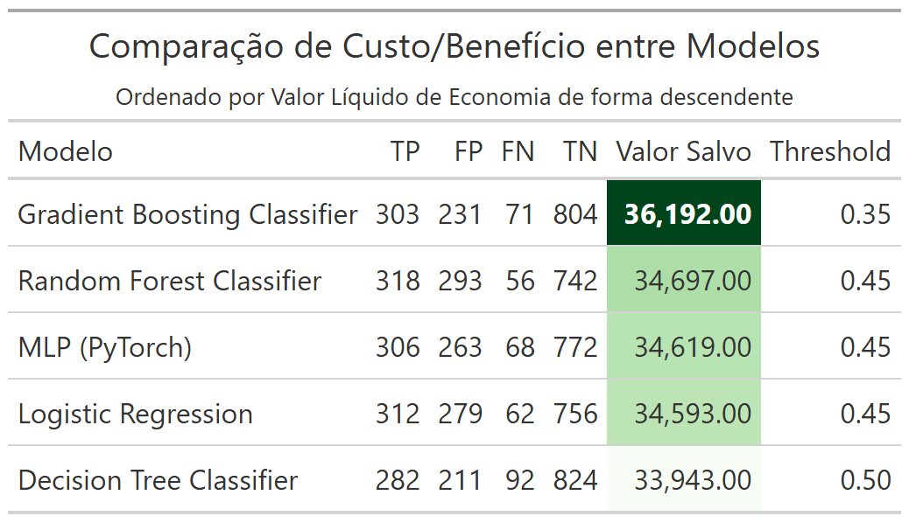

# Comparativo entre Modelos

Este projeto realizou um comparativo das métricas obtidas de alguns modelos de ML para o caso de predição de _churn_.

Também foi feito um comparativo de custo/benefício entre os modelos.

## Modelos Comparados

- Logistic Regression
- Decision Tree Classifier
- Random Forest Classifier
- Gradient Boosting Classifier
- MLP (PyTorch)

## Métricas Utilizada na Comparação

As seguintes métricas for utilizadas na comparação:
- Acurácia
- Precisão
- Recall
- F1-Score
- ROC-AUC
- PR-AUC
- Overfitting

Como podemos ver na figura abaixo, com excessão ao _overfitting_ todos os modelos apresentaram valores semelhantes nas métricas. Mas, apesar da diferença de valores no _overfitting_, todos os modelos apresentaram valores muito próximos a 0 (zero), o que indica que os modelos realmente aprenderam com os dados e não somente "decoraram" os mesmos.

A tabela abaixo deixa mais clara essa comparação.

Esta tabela está ordenada de forma ascendente pelo PR-AUC, que é uma métrica mais adequada para problemas de identificação de _churn_.

Nela podemos ver que o modelo _Decision Tree Classifier_ se destaca com o maior PR-AUC, sendo seguido de perto pelo _Gradient Boosting Classifier_.

A rede neural (MLP PyTorch) também teve um desempenho próximo aos dois primeiros porém não conseguiu superá-los na identificação do _churn_.

## Comparativo de Custo/Benefício dos Modelos

Para o comparativo de custo/benefício dos modelos foi adotada uma estratégia de cálculo do benefício financeiro obtido ao manter o possível cliente que iria sair (_churn) descontando o custo de dar um desconto para o mesmo para que ele fique na empresa.

Neste comparativo demonstramos o quanto a empresa economizaria ao conseguir manter o cliente. A tabela, ordenada de forma descendente por _Valor Salvo_, nos mostra que o modelo Gradient Boosting Classifier é o que traria melhores resultados para a empresa.