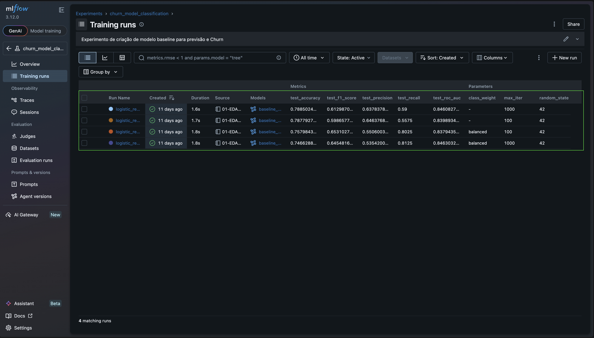
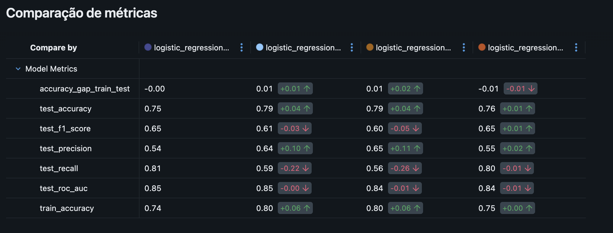

# MLflow

Este projeto usa o MLflow em modo local (file store) para registrar experimentos, métricas e artefatos de modelagem.

## Onde fica o histórico

O histórico de experimentos fica em `data/mlflow_tracking/mlruns/`.

Para manter o repositório leve, artefatos pesados não devem ser versionados.

## Como abrir a UI

Na raiz do repositório:

```bash
make run-mlflow
```

Isso sobe o servidor local em `http://127.0.0.1:5000`.

O target executa o comando dentro de `data/mlflow_tracking/`, então o MLflow usa o `./mlruns` desse diretório automaticamente.

## Padrão de uso nos notebooks

Nos notebooks, configure o tracking para usar o file store do projeto:

```python
import mlflow

mlflow.set_tracking_uri("file:../data/mlflow_tracking/mlruns")
mlflow.set_experiment("churn_model_classification")
```

## Experimentos registrados

O projeto possui um experimento principal, `churn_model_classification`, que consolida runs de modelagem para previsão de churn no dataset Telco.

### Overview dos experimentos


A interface mostra o histórico de experimentos com runs, timestamps e status.

## Runs e métricas

### Visualização de runs



Cada run pode registrar:

- **Parâmetros**: configurações do modelo, pré-processamento e treinamento
- **Métricas**: acurácia, precisão, recall/sensibilidade, F1-Score, ROC-AUC, PR-AUC e gaps de treino/teste quando disponíveis
- **Artefatos**: modelos, gráficos, relatórios e arquivos auxiliares de avaliação

### Detalhes dos experimentos


A visualização detalhada permite comparar múltiplas runs lado a lado.

### Métricas de performance



As métricas ajudam a comparar performance e estabilidade:

- **Train/Test Accuracy**: monitora overfitting
- **F1-Score**: avalia o balanço entre precisão e recall
- **ROC-AUC**: mede capacidade discriminativa
- **PR-AUC**: útil para classes desbalanceadas
- **Accuracy Gap**: diferença entre treino e teste

## Artefatos e modelos registrados

### Artefatos do modelo


Cada run pode armazenar múltiplos artefatos:

- `confusion_matrix.png` - matriz de confusão do modelo
- `roc_curve.png` - curva ROC e AUC
- `classification_report.json` - relatório detalhado
- arquivos de importância de features, quando o algoritmo permite esse tipo de interpretação
- modelos serializados ou referências para artefatos de treinamento

### Modelo operacional


O histórico de MLflow inclui baselines clássicos e experimentos de comparação. O artefato operacional usado pela API é a MLP PyTorch gerada localmente:

| Item | Valor |
|---|---|
| Modelo final | MLP (PyTorch) |
| Artefato servido | `models/mlp.joblib` |
| Comando de geração | `make train` |
| Tracking local | `data/mlflow_tracking/mlruns/` |

Os baselines registrados no MLflow continuam úteis para comparação e rastreabilidade, mas não são a origem oficial da API em runtime.

#### Acessar o modelo operacional

```python
import joblib

model = joblib.load("models/mlp.joblib")
predictions = model.predict(X_novo)
probabilities = model.predict_proba(X_novo)
```

Para analisar runs e artefatos históricos, abra a UI com `make run-mlflow`.

## Estrutura de diretórios do MLflow

```text
data/mlflow_tracking/mlruns/
├── 0/
│   └── meta.yaml
├── 971373804994683566/
│   ├── meta.yaml
│   ├── <run_id_1>/
│   │   ├── meta.yaml
│   │   ├── params/
│   │   ├── metrics/
│   │   ├── artifacts/
│   │   │   ├── confusion_matrix.png
│   │   │   ├── roc_curve.png
│   │   │   ├── classification_report.json
│   │   │   └── ...
│   │   └── tags/
│   ├── <run_id_2>/
│   └── ...
├── models/
└── tags/
```

## Monitoramento e boas práticas

### Rastreabilidade

- Cada run é identificável por UUID único
- Parâmetros e hiperparâmetros relevantes são registrados
- Métricas de avaliação ficam disponíveis para comparação
- O modelo servido pela API é recriado por `make train`

### Comparação de modelos

O MLflow permite comparar múltiplos runs:

1. Abrir a UI em `http://127.0.0.1:5000`
2. Selecionar as runs desejadas
3. Comparar métricas, parâmetros e artefatos lado a lado

### Seleção do melhor modelo

```python
best_run = client.search_runs(
    experiment_ids=["971373804994683566"],
    order_by=["metrics.roc_auc DESC"],
    max_results=1,
)[0]

best_run_id = best_run.info.run_id
```

## Próximos passos: otimização e registro

### 1. Consolidar critérios de promoção

- Definir métrica primária por objetivo de negócio
- Registrar o threshold operacional usado pela API
- Documentar quando um novo modelo substitui o champion

### 2. Tuning de hiperparâmetros

- GridSearchCV / RandomizedSearchCV
- Cada combinação registrada como um novo run

### 3. Registrar melhor modelo

```python
mlflow.register_model(
    model_uri="runs:/<RUN_ID>/<ARTIFACT_PATH>",
    name="telco_churn_predictor",
)

client.transition_model_version_stage(
    name="telco_churn_predictor",
    version=1,
    stage="Staging",
)
```
