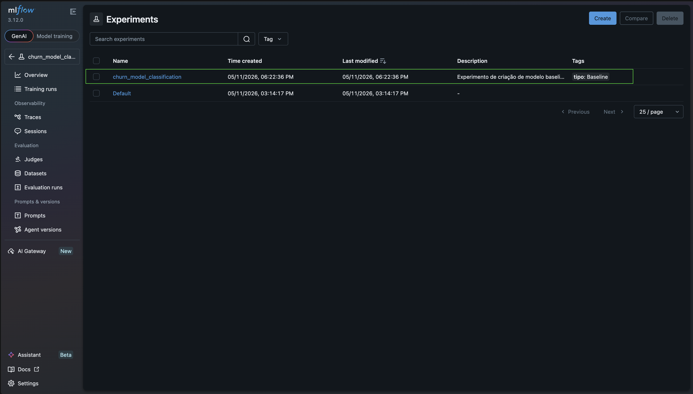
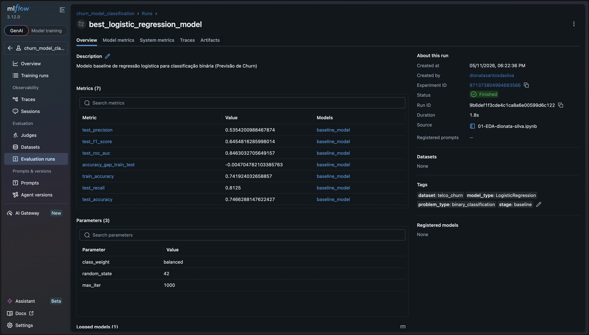
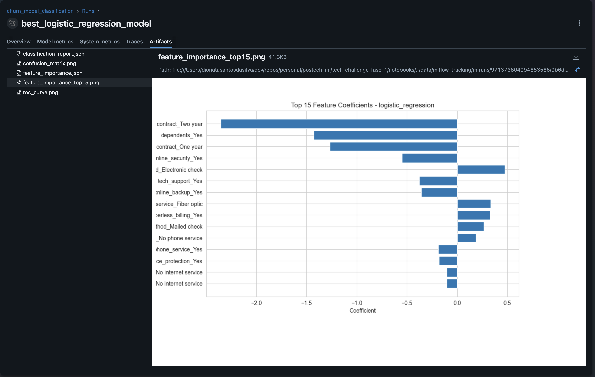
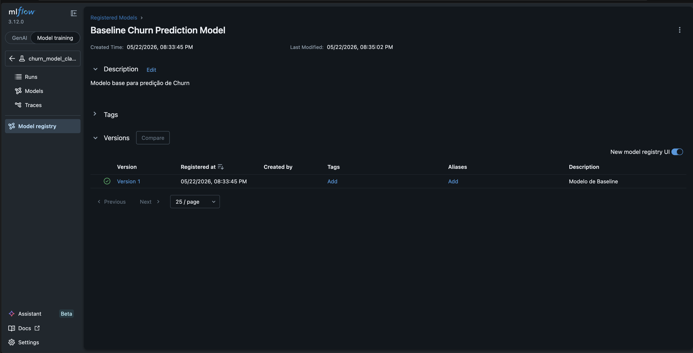

# MLflow

Este projeto usa o MLflow em modo local (file store) para registrar experimentos.

## Onde fica o historico

O historico de experimentos fica em `data/mlflow_tracking/mlruns/`.

Para manter o repositorio leve, artefatos pesados (modelos, figuras, etc.) nao foram versionados.

## Como abrir a UI

Na raiz do repositorio:

```bash
make run-mlflow
```

Isso sobe o servidor local em `http://127.0.0.1:5000`.

Obs: o target `make run-mlflow` executa o comando dentro de `data/mlflow_tracking/`,
entao o MLflow usa o `./mlruns` desse diretorio automaticamente.

## Padrão de uso nos notebooks

Nos notebooks, configurar o tracking para usar o file store do projeto:

```python
import mlflow

mlflow.set_tracking_uri("file:../data/mlflow_tracking/mlruns")
mlflow.set_experiment("churn_model_classification")
```

---

## Experimentos Registrados

O projeto possui um experimento principal: **`churn_model_classification`** que consolida todos os runs de modelagem para previsão de churn no dataset Telco.

### Overview dos Experimentos



A interface mostra o histórico completo de experimentos com suas respectivas runs, timestamps e status.

---

## Runs e Métricas

### Visualização de Runs


Cada run no MLflow registra:
- **Parâmetros**: Configurações do modelo (random_state, max_iter, class_weight, etc.)
- **Métricas**: Acurácia, Precisão, Recall, F1-Score, ROC-AUC
- **Artefatos**: Modelos, gráficos, relatórios

### Detalhes dos Experimentos



A visualização detalhada mostra comparação de múltiplas runs lado a lado para análise comparativa.

### Métricas de Performance


As métricas são rastreadas em tempo real durante o treinamento:
- **Train/Test Accuracy**: Monitora overfitting
- **F1-Score**: Avalia balanço entre Precisão e Recall
- **ROC-AUC**: Capacidade discriminativa do modelo
- **Accuracy Gap**: Diferença entre treino e teste

---

## Artefatos e Modelos Registrados

### Artefatos do Modelo



Cada run armazena múltiplos artefatos:
- `confusion_matrix.png` - Matriz de confusão do modelo
- `roc_curve.png` - Curva ROC e AUC
- `feature_importance_top15.png` - Features mais importantes
- `classification_report.json` - Relatório detalhado
- `feature_importance.json` - Importância de todas as features

### Modelo Registrado



O modelo treinado é persistido no MLflow com:
- **Framework**: scikit-learn (LogisticRegression)
- **Formato**: Pickle (MLflow SKlearn flavor)
- **Localização**: `data/mlflow_tracking/mlruns/<experiment_id>/<run_id>/artifacts/baseline_model/`

#### Acessar o Modelo

```python
import mlflow

# Conectar ao MLflow
mlflow.set_tracking_uri("file:../data/mlflow_tracking/mlruns")

# Opção 1: Carregar modelo pelo URI
model_uri = "runs://<RUN_ID>/baseline_model"
model = mlflow.sklearn.load_model(model_uri)

# Opção 2: Carregar modelo registrado (se disponível no registry)
model = mlflow.sklearn.load_model("models:/baseline_model/latest")

# Fazer predições
predictions = model.predict(X_test)
```

---

## Estrutura de Diretórios do MLflow

```
data/mlflow_tracking/mlruns/
├── 0/                                    # Experiment ID 0
│   └── meta.yaml
├── 971373804994683566/                   # Experiment ID (churn_model_classification)
│   ├── meta.yaml
│   ├── <run_id_1>/
│   │   ├── meta.yaml
│   │   ├── params/
│   │   ├── metrics/
│   │   ├── artifacts/
│   │   │   ├── baseline_model/
│   │   │   ├── confusion_matrix.png
│   │   │   ├── roc_curve.png
│   │   │   └── feature_importance_top15.png
│   │   └── tags/
│   ├── <run_id_2>/
│   └── ...
├── models/
│   └── Baseline Churn Prediction Model/
└── tags/
```

---

## Monitoramento e Boas Práticas

### Rastreabilidade
- ✓ Cada run é identificável por UUID único
- ✓ Todos os parâmetros e hiperparâmetros são registrados
- ✓ Métricas são capturadas em múltiplos timestamps
- ✓ Reproducibilidade garantida via `random_state` fixo

### Comparação de Modelos
O MLflow permite comparar múltiplos runs:
1. Abrir a UI em `http://127.0.0.1:5000`
2. Selecionar as runs desejadas
3. Comparar métricas, parâmetros e artefatos lado a lado

### Seleção do Melhor Modelo
```python
# Buscar o melhor run por métrica
best_run = client.search_runs(
    experiment_ids=["971373804994683566"],
    order_by=["metrics.test_roc_auc DESC"],
    max_results=1
)[0]

best_model_uri = f"runs:/{best_run.info.run_id}/baseline_model"
```

---

## Próximos Passos: Otimização e Registro

### 1. Experimentar Novos Modelos
- Random Forest
- XGBoost
- SVM com kernel RBF

### 2. Tuning de Hiperparâmetros
- GridSearchCV / RandomizedSearchCV
- Cada combinação registrada como um novo run

### 3. Registrar Melhor Modelo
```python
mlflow.register_model(
    model_uri=best_model_uri,
    name="telco_churn_predictor"
)

# Transição para Staging
client.transition_model_version_stage(
    name="telco_churn_predictor",
    version=1,
    stage="Staging"
)

# Após validação, promover para Production
client.transition_model_version_stage(
    name="telco_churn_predictor",
    version=1,
    stage="Production"
)
```